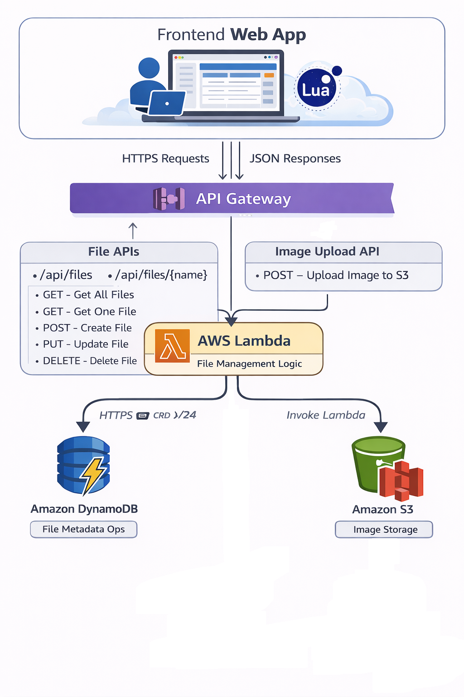

---

# 自訂腳本任務管理系統

**Custom Script Task Manager with Lua SDK**

---

## 一、系統簡介

本系統為一套 **以 UI / 宿主邏輯為核心（Host-driven）** 的任務與文件管理系統，
並提供 **Lua 腳本作為受控的輔助工具**，用於進行批次操作、條件處理與規則化流程。

Lua **不是系統主控層**，亦 **不具備任何直接影響雲端狀態的能力**。
所有對雲端資料的寫入操作，**必須由宿主在 Lua 腳本結束後逐筆確認並執行**。

此設計目的在於：

* 防止腳本誤判「預覽狀態等同成功」
* 明確劃分 Local（預覽）與 Cloud（最終）責任邊界
* 允許 LLM 產生腳本但不產生隱式副作用

---

## 二、系統整體架構

### 2.1 架構圖



**Figure 1.** 系統整體架構示意圖。
Frontend Web App 為唯一主控層，內部包含 Lua Sandbox。
所有雲端請求皆經由 API Gateway 轉發至 AWS Lambda，
結構化任務資料儲存於 DynamoDB，圖片或附件儲存於 Amazon S3。

---

### 2.2 架構分層說明

整體架構可清楚分為四個層級：

1. **Frontend Web App（主控層）**
2. **Lua Sandbox / SDK（受控輔助層）**
3. **Serverless Backend（API Gateway + Lambda）**
4. **Data Layer（DynamoDB + S3）**

各層責任邊界明確，不存在隱式同步或跨層副作用。

---

## 三、Frontend Web App（主控層）

Frontend Web App 是 **系統中唯一擁有雲端寫入權限的元件**，負責：

* 使用者互動與 UI 呈現
* Lua 腳本的啟動、停止與 instruction budget 控制
* LocalFile（預覽狀態）維護
* 寫入請求佇列（`pendingOps`）管理
* Lua 腳本結束後的 Modal 確認流程
* 實際雲端 API 呼叫（經由 API Gateway）

Lua 腳本即使在前端執行，
**也無法直接呼叫雲端 API 或修改雲端狀態**。

---

## 四、Lua Sandbox 與執行模型

### 4.1 核心執行模型

Lua 腳本執行期間：

* **只能操作 LocalFile（預覽世界）**
* 不會直接寫入雲端
* 所有寫入請求僅會加入 `pendingOps`

Lua 腳本結束後：

* 系統依序處理 `pendingOps`
* 每一筆操作皆顯示確認視窗（Modal）
* 使用者選擇：

  * **OK** → 實際寫入雲端
  * **Cancel** → 該筆操作完全不執行

---

### 4.2 LocalFile（預覽狀態）

LocalFile 為一個 **暫存、可觀察、可回滾的狀態世界**，用途包含：

* 即時顯示 Lua 腳本操作結果
* 供使用者在雲端寫入前檢視變更
* 教學與腳本測試用途

```lua
printCard(name)
```

僅顯示 LocalFile 中的資料，
**不代表任何雲端狀態已被修改**。

---

## 五、Lua SDK（系統 API 合約）

### 5.1 可用全域函數

#### 同步函數（禁止 `:await()`）

```lua
print(...)
printCard(name)

createFile(name, payload)
updateFile(name, payload)
deleteFile(name)
```

#### 非同步函數（必須 `:await()`）

```lua
listFiles():await()     -- table<string>
getFile(name):await()   -- FileRecord | nil
```

---

### 5.2 await 使用規則

* 僅 `listFiles()` 與 `getFile()` 可以使用 `:await()`
* 對其他函數使用 `:await()` 屬於 **合約違反**

#### 正確用法（含容錯）

```lua
local ok, names = pcall(function()
  return listFiles():await()
end)

if not ok then
  print("listFiles failed:", tostring(names))
  return
end
```

#### 錯誤用法（禁止）

```lua
print():await()
createFile(...):await()
```

---

## 六、FileRecord 合約

```lua
FileRecord = {
  content   = string,
  status    = "TODO" | "DOING" | "DONE",
  priority  = number,        -- 1..5
  dueAt     = string,        -- ISO-8601
  createdAt = string,        -- ISO-8601
  updatedAt = string         -- ISO-8601
}
```

### 6.1 dueAt 規則（強制）

* 僅接受 **ISO-8601 字串**
* 範例：

```text
2026-01-07T23:59:00Z
```

* 不接受毫秒 timestamp（例如 `1700000000000`）

---

## 七、預覽與雲端驗證流程

### 7.1 建立或更新（預覽）

```lua
createFile("task.txt", {
  content  = "hello",
  status   = "TODO",
  priority = 3,
  dueAt    = "2026-01-07T23:59:00Z"
})

printCard("task.txt") -- 僅代表 LocalFile
```

---

### 7.2 雲端驗證（必須在 Modal 完成後）

```lua
local f = getFile("task.txt"):await()
```

---

## 八、雲端後端架構

### 8.1 API Gateway + AWS Lambda

前端僅透過 HTTPS 與 API Gateway 溝通，
由 AWS Lambda 執行實際雲端邏輯。

#### File APIs

* `GET /api/files`
* `GET /api/files/{name}`
* `POST /api/files`
* `PUT /api/files/{name}`
* `DELETE /api/files/{name}`

#### Image Upload API

* `POST /api/upload`
* 圖片寫入 Amazon S3
* 與 Lua / 任務核心模型分離

---

## 九、資料儲存層

### 9.1 DynamoDB（結構化任務資料）


**Figure 2.** DynamoDB `files-table` 範例畫面。
每一筆資料代表一個雲端 FileRecord，欄位包含：

* `name`（Primary Key）
* `content`
* `status`
* `priority`
* `dueAt`
* `createdAt`
* `updatedAt`

此資料表僅代表 **雲端最終狀態**，
不反映 Lua 腳本執行期間的 LocalFile 預覽。

---

### 9.2 Amazon S3（非結構化資料）

* 儲存圖片或附件
* 與 DynamoDB 任務資料分離
* 不影響 Lua SDK 與 pendingOps 模型

---

## 十、錯誤與中斷行為（輸出格式）

系統錯誤輸出 **僅包含使用者腳本位置**，不顯示 wrapper stack。

```text
Stopped by user at @user:LINE
Instruction limit exceeded (BUDGET) at @user:LINE
```

禁止出現：

* wrapper stack
* `[string "..."]`
* Lua 內部 traceback

---

## 十一、設計取向總結

* 不自動同步 Local 與 Cloud
* 不假設預覽等於成功
* 不容許未定義 API 行為
* 所有狀態變化皆可觀察、可中斷、可驗證

---

## 十二、適用場景

* 任務 / 文件管理系統
* 批次處理與規則化操作
* Lua Sandbox 教學
* LLM 產生腳本但需嚴格行為邊界的系統

---

